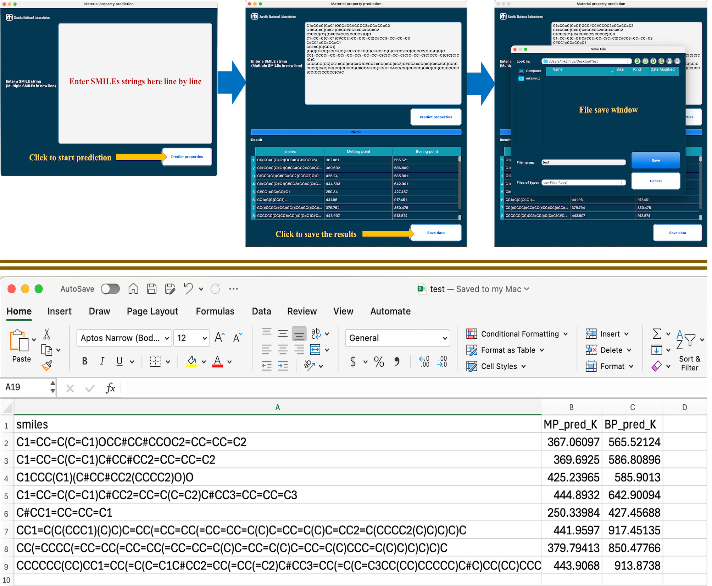

<div align="center">
  
  <h1>P2MAT — Material Property Prediction Tool</h1>
  <p>
    A desktop GUI application for predicting thermophysical properties of
    chemical compounds from SMILES strings, powered by domain-specific
    stacking ensemble models (LightGBM · XGBoost · ExtraTrees · DNN → Ridge).
  </p>
</div>

---

## Table of Contents

- [Predicted Properties](#predicted-properties)
- [Installation](#installation)
- [Running from Source](#running-from-source)
- [Usage](#usage)
- [Limitations](#limitations)

---

## Predicted Properties

| Property | Unit | Model |
|---|---|---|
| Melting Point | K | Stacking ensemble (LightGBM + XGBoost + ExtraTrees + DNN → Ridge) |
| Boiling Point | K | Stacking ensemble (LightGBM + XGBoost + ExtraTrees + DNN → Ridge) |

Each property is predicted using three domain-specific models — one for CHO-only compounds, one for CHON compounds, and one for the full element set — with automatic routing based on the input SMILES.

---

## Installation

For full installation instructions (building distributables, platform-specific installers, uninstalling, and troubleshooting) see [`Release/README.md`](../Release/README.md).

---

## Running from Source

If the `qsar` conda environment is already set up, `installer.sh` lets you launch P2MAT directly on macOS or Linux without going through the platform installers.

Install prerequisites (Homebrew, Java, Miniconda):

```bash
sh installer.sh prep
```

Launch the application:

```bash
sh installer.sh run
```

Install prerequisites and launch in one step:

```bash
sh installer.sh both
```

> **Windows:** `installer.sh` is a bash script and does not run natively on Windows. Use `Release/windows/Install-P2MAT.ps1` instead.

---

## Usage

### 1. Enter SMILES

Type one SMILES string per line in the input box.

Sample SMILES for testing:

```
C1=CC=C(C=C1)OCC#CC#CCOC2=CC=CC=C2
C1=CC=C(C=C1)C#CC#CC2=CC=CC=C2
C1CCC(C1)(C#CC#CC2(CCCC2)O)O
C1=CC=C(C=C1)C#CC2=CC=C(C=C2)C#CC3=CC=CC=C3
C#CC1=CC=CC=C1
CCO
c1ccccc1
CC(=O)Oc1ccccc1C(=O)O
```

### 2. Select properties

Tick the checkboxes for the properties you want to predict. At least one must
remain checked at all times.

### 3. Predict

Click **Predict properties**. The progress bar advances as each molecule is
processed. Invalid SMILES are listed above the results table.

### 4. Export

Click **Save data** to export the results table as a CSV file.

### GUI overview



---

## Limitations

**Platform**
- macOS is supported on **Apple Silicon (M1 / M2 / M3 / M4) only**. Running on Intel Macs requires retraining the DNN components on x86 hardware.
- Linux supports **x86\_64 and aarch64** only; other architectures are untested.
- Validated on macOS 12–15, Windows 10 / 11 (x64), Ubuntu 22.04, and Fedora 40.

**Model accuracy**
- Predictions are most reliable for molecules structurally similar to the training set. Compounds far outside the training domain may yield unreliable results.
- Each model is trained on a specific elemental domain (CHO / CHON / full). Heavily heteroatom-substituted compounds may fall in the less-represented "full" subset, where accuracy is typically lower.

**Runtime**
- Very large or heavily branched molecules may exceed PaDEL-Descriptor's per-molecule timeout. Process them individually or increase the Java heap size.
- P2MAT requires a graphical display. On headless Linux servers, a virtual framebuffer (`Xvfb`) can be used as a workaround.
